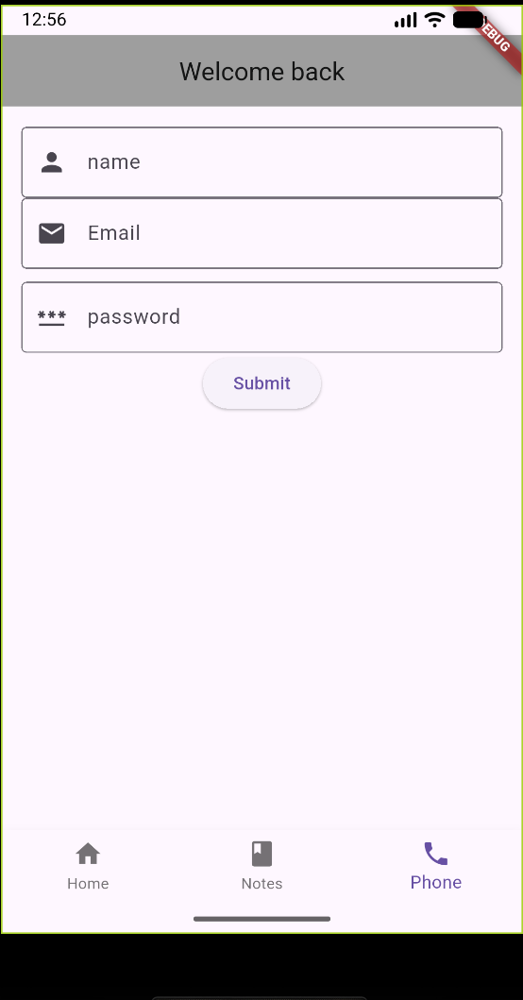

# WidgetPresentation

A Flutter app with a bottom navigation widget to switch between Home, Notes, and Phone screens.

---

## Screenshot



---

## Run Instructions

```bash
git clone https://github.com/your-username/widgetpresentation.git
cd widgetpresentation
flutter pub get
flutter run

Widget Highlights

State Preservation – Screens keep their state using IndexedStack.

Dynamic Navigation – BottomNavigationBar allows seamless tab switching.

Customizable Tabs – Each tab has its own icon, label, and color.

